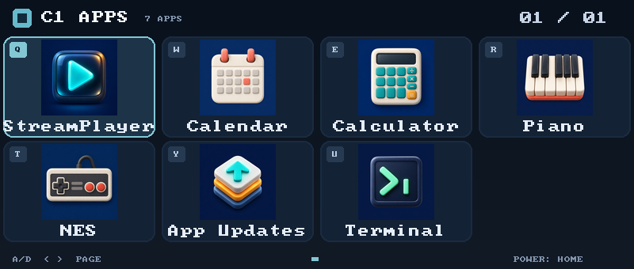
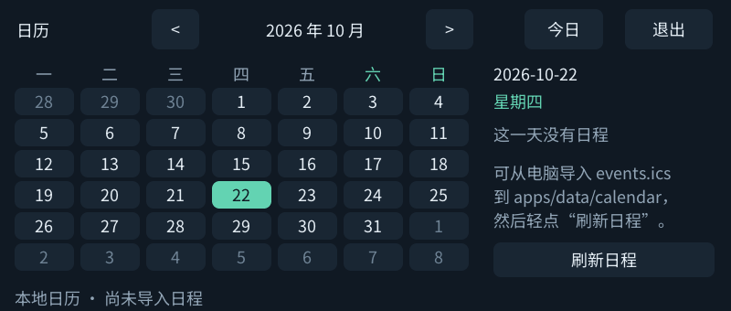
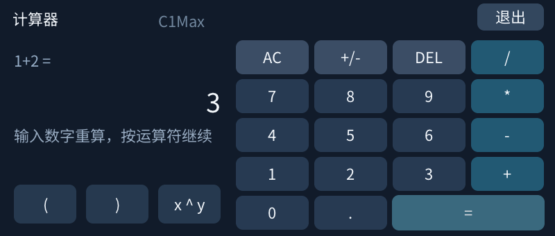
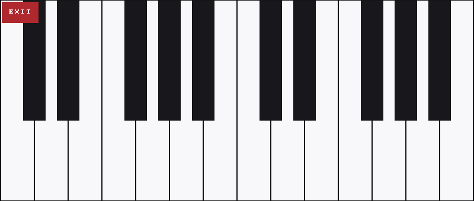
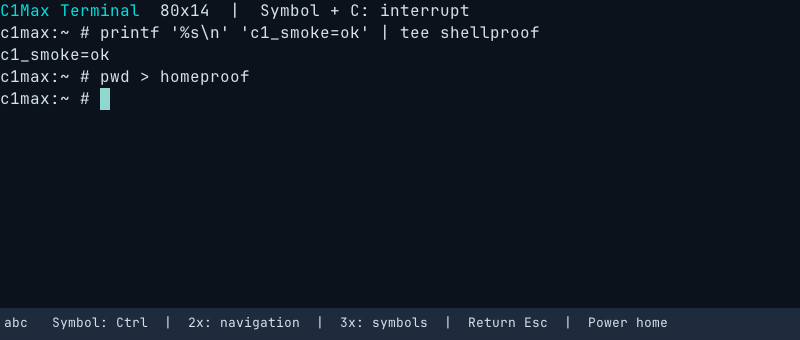
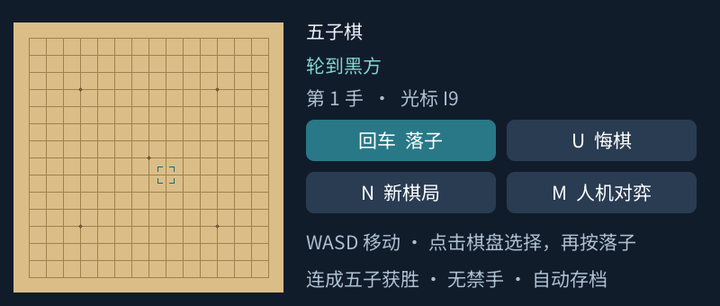
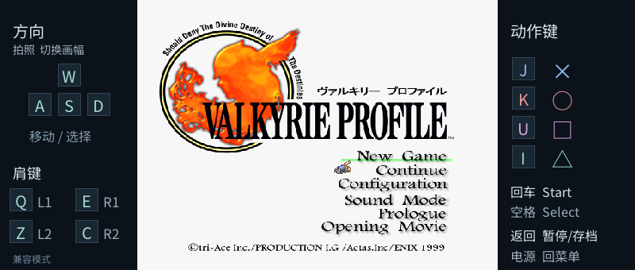
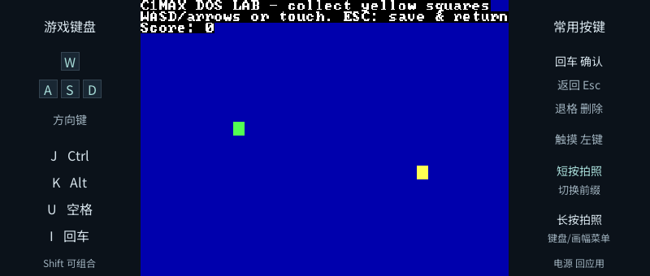
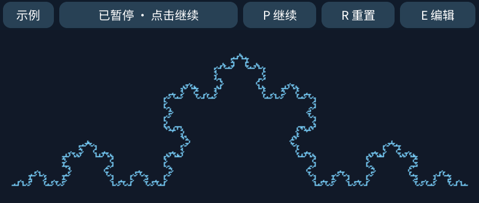

# C1Max 原生应用

目标是快易典 C1 Max / Ingenic X2000：MIPS32r2 little-endian、Linux 4.4、128 MB RAM、800×340 触屏。这里是原生 Linux 程序，不是 APK。

```text
apps/
├── launcher/       应用入口、原装桌面退出/恢复监督器
├── streamplayer/   Emby / Jellyfin：登录、媒体库、服务器转码播放
├── calendar/       月历、本地日程增删改、ICS 订阅管理
├── terminal/       PTY / ANSI / UTF-8 终端、物理控制键
├── linux-tools/    独立 bash / less / nano / SSH 客户端工具包
├── calculator/     四则运算、括号、乘方、小数
├── gomoku/         人机／双人五子棋、悔棋和自动续局
├── pcsx4all/       PS1 模拟器、游戏库、即时存档（自备游戏）
├── dosbox/         DOS 游戏库、命令行与实体键盘（解释器）
├── processing/     QuickJS 绘图、四个官方示例改编与物理键盘编辑
├── piano/          触屏钢琴
├── nes/            InfoNES 平台适配与实验记录
├── shared/         LVGL 显示/触摸、网络、tinyalsa、中文字体
├── tools/          Docker 交叉编译、打包、ADB 部署
├── tests/          清单/API 回归测试
├── catalog.json    GitHub 公开更新接口的版本及源码修订清单
├── .deps/          固定版本第三方源码（忽略）
├── .build/         编译产物、设备包和本机验证输出（忽略）
└── .runtime/       本机私有配置与临时调试文件（忽略）
```

旧的顶层 `launcher/`、`piano/`、`emu/` 已分别迁入这里，tinyalsa 合并到 `shared/`。来源是 CardputerZero 的应用保留在各自 README 中；未改写原工程。

## 设备截图

下图均为 C1 Max 设备画面。模拟器截图展示实际运行中的内容；PS1 镜像及 NES ROM 由用户自行提供，仓库不包含游戏镜像。DOSBox 图为项目自带的 DOS LAB 小游戏。点图可查看 800×340 原图。

<table>
  <tr>
    <td width="50%"><strong>Launcher / 应用更新</strong><br><a href="docs/screenshots/launcher.png"></a><br>自定义应用网格与更新检查入口。</td>
    <td width="50%"><strong>StreamPlayer</strong><br><a href="docs/screenshots/streamplayer.png"></a><br>Emby / Jellyfin 远程转码视频的设备播放画面。</td>
  </tr>
  <tr>
    <td><strong>日历</strong><br><a href="docs/screenshots/calendar.png"></a><br>月历、节假日与日程视图。</td>
    <td><strong>计算器</strong><br><a href="docs/screenshots/calculator.png"></a><br>物理键盘操作的四则运算界面。</td>
  </tr>
  <tr>
    <td><strong>钢琴</strong><br><a href="docs/screenshots/piano.png"></a><br>适配屏幕宽度的钢琴键盘。</td>
    <td><strong>终端与 Linux 工具</strong><br><a href="docs/screenshots/terminal.png"></a><br>交互式 shell；另附 bash、less、nano、SSH 等常用工具。</td>
  </tr>
  <tr>
    <td><strong>五子棋</strong><br><a href="docs/screenshots/gomoku.png"></a><br>人机／双人对局、悔棋与自动续局。</td>
    <td><strong>NES 游戏</strong><br><a href="docs/screenshots/nes.png"></a><br>当前图为设备端渲染／输入自测；运行游戏需自行准备 `.nes` 文件。</td>
  </tr>
  <tr>
    <td><strong>PCSX4all</strong><br><a href="docs/screenshots/pcsx4all.png"></a><br>PS1 游戏运行画面示例，游戏镜像不随仓库发布。</td>
    <td><strong>DOSBox</strong><br><a href="docs/screenshots/dosbox.png"></a><br>DOS LAB 正在运行；4:3 游戏区周围保留设备按键提示。</td>
  </tr>
  <tr>
    <td><strong>Processing</strong><br><a href="docs/screenshots/processing.png"></a><br>Processing 风格的绘图示例与 sketch 控制栏。</td>
    <td></td>
  </tr>
</table>

## 构建、同步与启动

可独立克隆此仓库；在主仓库中它位于 `apps/` submodule。以下命令从本仓库根目录执行（在主仓库先 `cd apps`）。

主机需要 Docker、Python 3.12+、Git、curl 和 adb，截图另需 ffmpeg。无需旧的 Lima VM 或特定开发者绝对路径。

```sh
./tools/build.sh
python3 ./tools/deploy.py --serial MagicPen-931f06 --start
```

构建固定 LVGL / InfoNES / PCSX4all / DOSBox Pure 的提交及 QuickJS / zlib 源码校验值，编译静态 MIPS ELF，生成运行包。部署先传到新的 release 目录、逐文件校验 SHA-256，再通过 `rename(2)` 原子切换 `current`。保留旧版本，不覆盖用户数据；运行中的 launcher 必须先退出。

```text
/storage/apps/
├── current -> releases/<时间-校验值>/
├── releases/<版本>/
│   ├── launcher/{c1max-launcher,run.sh,apps.txt,icons/,manifest.json}
│   ├── streamplayer/c1max-streamplayer
│   ├── calendar/c1max-calendar
│   ├── calculator/c1max-calculator
│   ├── terminal/{c1max-terminal,assets/}
│   ├── linux-tools/{bin/,share/}
│   ├── gomoku/c1max-gomoku
│   ├── pcsx4all/{c1max-pcsx4all,c1max-psx-core,licenses/}
│   ├── dosbox/{c1max-dosbox,c1max-dos-core,C1LAB.COM,licenses/}
│   ├── processing/{c1max-processing,api.js,examples/,licenses/}
│   ├── piano/c1max-piano
│   ├── nes/c1max-nes
│   ├── shared/{字体,CA证书,c1max-activate,c1max-volume,c1max-capture}
│   └── catalog.json
└── data/
    ├── launcher/      锁、运行日志
    ├── streamplayer/  config.json 登录令牌（0600）
    ├── calendar/      本地数据库、订阅缓存、导出 ICS
    ├── terminal/      shell HOME 与历史
    ├── gomoku/        自动续局
    ├── pcsx4all/      自备游戏、BIOS、记忆卡和即时存档
    ├── dosbox/        DOS 游戏完整目录、设置与游戏存档
    ├── processing/    my-sketch.js 用户程序
    ├── calculator/
    └── nes/roms/      自备合法 .nes 文件
```

已部署后重新打开：

```sh
adb -s MagicPen-931f06 shell 'nohup setsid /storage/apps/current/launcher/run.sh </dev/null >/storage/apps/data/launcher/run.log 2>&1 & sleep 1'
```

设备端快捷入口：安装后，在原装界面按住 **Shift＋右下角回车至少 1.5 秒，再松开**。短按不触发。安装命令：

```sh
python3 ./tools/hotkey_service.py install --serial MagicPen-931f06
# 禁用快捷键并移除下次启动的服务定义：
python3 ./tools/hotkey_service.py remove --serial MagicPen-931f06
```

安装器为 `/etc/init.rc` 追加独立 `c1apps-hotkey` 服务及 smartUI 运行时触发器，先备份、校验并原子写入，随后把系统分区恢复只读；不修改永久 ADB 脚本。当前运行直接启动热键监听，开机服务定义在下次启动载入。设备备份在 `/storage/apps/backups/hotkey-*/init.rc.before`，主机备份在 `.runtime/backups/`。常驻监听不抢占键盘，退出 launcher 后继续可用。

所有自定义应用短按电源键回 launcher；launcher 短按电源回原装桌面。进入自定义应用会真正停止 `smartUI` 和其中的原装界面，释放其内存；媒体、网络和 ADB 服务保留。监督器负责正常退出、launcher 崩溃后的原状态恢复。不要直接停掉监督器，也不要直接运行多个 framebuffer 应用。详见 [前台恢复边界](launcher/foreground-notes.md)。原装桌面增加图标需要另外接入厂商菜单；本次没有修改原装桌面二进制，也没有开机替换原桌面。

## GitHub 更新检查

launcher 的 **App Updates** 打开检查页，访问：

`https://api.github.com/repos/zhuzhe1983/C1Max-Apps/contents/catalog.json?ref=main`

使用 GitHub raw 内容类型读取 JSON，要求 `schema: 1`、`platform: c1max-mipsel-linux`。每项包含 `id`、三段数字 `version`、64 位 SHA-256 `revision`。检查新增应用、版本升级、同版本源码变化；远程旧版本不会报成升级。HTTPS 验证证书，限制大小、超时及格式，不执行远端命令。

按照当前选择，暂时只做公开更新接口，不存 GitHub Token、不自动下载安装。私有仓库/尚未发布清单的 404 明确提示更新源未公开或未发布；断网不显示“已是最新版”。更新源为公开仓库 C1Max-Apps，推送清单后即可检查，发布新应用前运行打包更新 `catalog.json`。源码 revision 用于变更检测，不能替代未来安装包签名。

## 验证

```sh
./gomoku/tests/run.sh
./calculator/tests/run.sh
sh ./calendar/tests/run.sh
./streamplayer/tests/run.sh
./tests/run-hotkey.sh
bash ./tests/run-keymap.sh
sh ./terminal/tests/run.sh
sh ./dosbox/tests/run.sh
# 设备上执行构建生成的 c1max-api-test：清单/版本/URL 校验
```

StreamPlayer 的 Emby 实机结果与未迁移部分见 [播放器说明](streamplayer/README.md)。日历/计算器各有独立模型测试。NES 需要自备 ROM，已加入 WASD/J/K 物理按键；尚待用户 ROM 实测兼容性。

DOS 的导入与键盘说明见 [DOSBox](dosbox/README.md)。PS1 的镜像路径、按键和兼容性见 [PCSX4all](pcsx4all/README.md)，绘图语言的支持范围与示例来源见 [Processing 2D](processing/README.md)。

全局物理键盘、Shift 与音量键说明：[键盘映射](docs-keyboard.md)。

新增应用规划及开源 B 站方案：[ROADMAP.md](ROADMAP.md)。图标由 imagegen 生成，原始 PNG 与完整提示词保存在 [launcher/assets](launcher/assets/)。当前待验收项见 [VALIDATION.md](VALIDATION.md)。
