# C1Max 原生应用

目标是快易典 C1 Max / Ingenic X2000：MIPS32r2 little-endian、Linux 4.4、128 MB RAM、800×340 触屏。这里是原生 Linux 程序，不是 APK。

```text
apps/
├── appstore/       按需安装、逐应用更新与首页管理
├── launcher/       应用入口、原装桌面退出/恢复监督器
├── streamplayer/   Emby / Jellyfin 视频与音乐、可选后台音乐播放
├── calendar/       月历、本地日程增删改、ICS 订阅管理
├── terminal/       PTY / ANSI / UTF-8 终端、物理控制键、远程 Coding Agent attach
├── linux-tools/    独立 bash / less / nano / SSH 客户端工具包
├── calculator/     四则运算、括号、乘方、小数
├── settings/       WLAN、亮度/熄屏、音量、USB、SSH 服务、电池与本机信息
├── gomoku/         人机／双人五子棋、悔棋和自动续局
├── pcsx4all/       PS1 模拟器、游戏库、即时存档（自备游戏）
├── dosbox/         DOS 游戏库、命令行与实体键盘（解释器）
├── processing/     QuickJS 绘图、四个官方示例改编与物理键盘编辑
├── hidpilot/       USB 键鼠与触控板
├── moonpilot/      Moonlight 远程桌面、AI 操作与语音对话
├── tox/            Tox 点对点文字聊天、ID 二维码与摄像头扫码添加
├── bilibili/       B 站热门、搜索、分 P、扫码登录与 360p MP4 直连播放
├── airtune/        Radio-Browser 网络电台目录、复古收音机界面
├── crosspoint/     本地电子书与 OPDS/Calibre 书目浏览
├── camera/         OV5648 拍立得：四种画幅、实时滤镜、相纸边框与相册
├── mail/           POP3 收件、SMTP 发件与本地账号配置
├── piano/          触屏钢琴、经典旋律自动演奏与可选后台播放
├── nes/            InfoNES 平台适配与实验记录
├── shared/         LVGL 显示/触摸、网络、tinyalsa、中文字体、电源守护
├── tools/          Docker 交叉编译、打包、ADB 部署
├── tests/          清单/API 回归测试
├── catalog.json    GitHub 公开更新接口的版本及源码修订清单
├── .deps/          固定版本第三方源码（忽略）
├── .build/         编译产物、设备包和本机验证输出（忽略）
└── .runtime/       本机私有配置与临时调试文件（忽略）
```

旧的顶层 `launcher/`、`piano/`、`emu/` 已分别迁入这里，tinyalsa 合并到 `shared/`。来源是 CardputerZero 的应用保留在各自 README 中；未改写原工程。

## 新增应用

- **[应用商店](appstore/README.md)**：按需安装、单独更新，控制首页显示，卸载时保留个人数据和回退版本。刷新目录不会下载全部应用。

- **[Tox 聊天](tox/README.md)**：基于 c-toxcore 的原生点对点聊天，支持气泡聊天、图片与语音直接预览、送达回执、本地待发队列、可选后台收发、ID 二维码和摄像头扫码添加。扫码提供数码裁剪与对焦；身份保存保留上一份有效快照。默认构建已包含，身份与聊天数据不随源码发布。
- **[设置](settings/README.md)**：左侧分类、右侧列表，W/S 选择、A/D 调节，触摸可整行点击并有大号 −／+ 和选项列表。WLAN 非阻塞扫描、连接结果与密码错误提示、隐藏网络、忘记网络；屏幕亮度、自动熄屏、媒体音量、USB ADB/MTP 切换（需确认）、SSH 服务、电池和本机信息。不提供关机、恢复出厂和蓝牙。
- **[远程 Terminal Coding](docs/remote-terminal-coding.md)**：C1Max 只运行轻量 Terminal/SSH，服务端用 Herdr 或其他会话管理器持久运行 Codex、Claude、Pi 等 Coding Agent；设备端 `agent` 命令负责 attach、分离和重连。
- **[HID 键鼠](hidpilot/README.md)**：USB HID 与 ADB / MTP 共存，触控板、实体键盘、修饰键和滚轮控制电脑。0.2.0 起专注手动输入。
- **[MoonPilot AI](moonpilot/README.md)**：独立的 Moonlight / Sunshine 远程操作应用，包含手动添加主机、PIN 配对、桌面预览、模型单步／十步操作，以及可配置 ASR、对话和 TTS。配对协议回归与真机解码通过；真实 Sunshine 串流和 AI 闭环待主机接入后验证。

- **[Bilibili](bilibili/README.md)**：参考 wiliwili 的接口，为本机重写轻量界面。热门、竖屏精选、搜索／BV 号、分 P、扫码登录、本机收藏和历史；优先直连 360p H.264/AAC MP4，无需自建转码服务。L 右转 90°，P/O 直接切换视频；支持暂停、跳转、音量和填宽／完整画面。未实现 DASH-only、番剧、直播和弹幕，验证范围见应用说明。

- **[Airtune 网络电台](airtune/README.md)**：拟物收音机界面，提供热门、国家、风格、心情和分组浏览，分类缓存后在后台刷新。SAVED 是本地电台列表，可收藏、手动添加 HTTP(S) 音频地址和删除；播放区显示真实连接状态与系统音量，可开关后台播放；搜索框内 W/S 正常输入文字。电台目录来自 Radio-Browser，音频直接连接电台源。
- **[CrossPoint 电子书](crosspoint/README.md)**：本地 EPUB、AZW3/MOBI、PDF、TXT、Markdown 文字阅读，以及 OPDS/Calibre 分类浏览、搜索、分页和下载。列表 W/S 移动选择，G 设置服务器，Q/E 翻页（A/D 保留）；EPUB 阅读中 W/S 换章。搜索支持 Rime 拼音和中文书目；PDF 首次后台提取文字、再次打开读取缓存。Shift＋音量 ± 调字号并保存。当前不渲染 EPUB 插图/完整 CSS，PDF 只提取文字，扫描版不适用。
- **[拍立得](camera/README.md)**：OV5648 实时取景，4:3、3:4、1:1、16:9 四种裁切画幅，六种滤镜，以及白相纸、奶油纸、黑胶片透明边框。空格／实体拍摄键拍照，带白闪和快门音；相册可浏览、确认删除。16:9 是裁切画幅，不是光学广角。
- **[邮件](mail/README.md)**：POP3S/STLS 收取最近八封邮件，SMTP TLS 编写、发送纯文本邮件，账号保存在设备私有配置中。当前没有 IMAP、附件、OAuth 或完整 HTML/MIME 阅读。下图展示未发送的演示草稿，尚未用真实邮箱完成收发验收。

- **[钢琴](piano/README.md)**：四首经典旋律简编、自动演奏、琴键高亮和可开关后台播放；拍摄键播放/暂停，Shift＋拍摄键切换后台。
- **[StreamPlayer](streamplayer/README.md)**：在 Emby/Jellyfin 音乐库选择音轨播放，支持队列、上一首/下一首和可开关后台音乐；视频仍使用原有播放路径。

钢琴、StreamPlayer 音乐、Airtune 的后台开关分别保存，默认关闭；同一时刻只播放一个来源。开启后回应用菜单或打开电子书可继续听，完全退出自定义桌面时停止。全局按住音量 − 到 3 秒立即静音；Shift＋音量快捷键不触发此操作。

## 中文输入与搜索

Airtune 的本地电台筛选、StreamPlayer 的远程媒体搜索、Bilibili 在线/本地搜索，以及聊天、邮件、日历、设置等文字字段支持本地 Rime 拼音。聚焦文字框后按拍摄键；StreamPlayer 媒体库按 F。候选确认不会直接发送消息或保存配置，具体字段与操作见[中文输入说明](docs/chinese-input.md)。

## 设备截图

下图均为 C1 Max 设备画面。Bilibili 的热门、搜索和播放画面来自真机联网测试。模拟器截图展示实际运行中的内容；PS1 镜像及 NES ROM 由用户自行提供，仓库不包含游戏镜像。DOSBox 图为项目自带的 DOS LAB 小游戏。点图可查看 800×340 原图。新增截图使用已部署应用：CrossPoint 为原创演示 EPUB，邮件为未发送的演示草稿；[截图说明](docs/screenshots/README.md)记录来源与拍摄方式。

<table>
  <tr>
    <td width="50%"><strong>Launcher / 应用更新</strong><br><a href="docs/screenshots/launcher.png">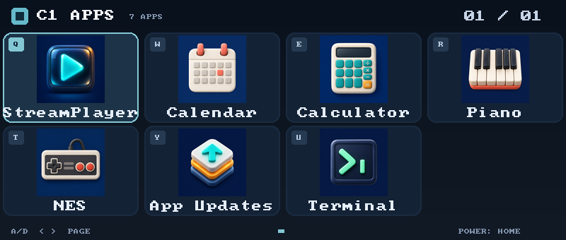</a><br>自定义应用网格与更新检查入口。</td>
    <td width="50%"><strong>StreamPlayer</strong><br><a href="docs/screenshots/streamplayer.png"></a><br>Emby / Jellyfin 远程转码视频的设备播放画面。</td>
  </tr>
  <tr>
    <td><strong>日历</strong><br><a href="docs/screenshots/calendar.png">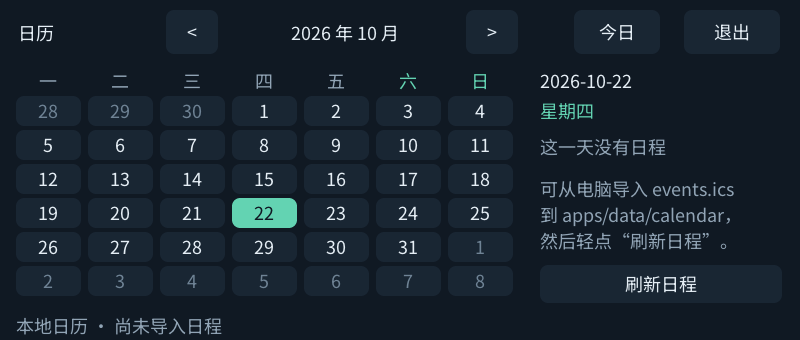</a><br>月历、节假日与日程视图。</td>
    <td><strong>计算器</strong><br><a href="docs/screenshots/calculator.png">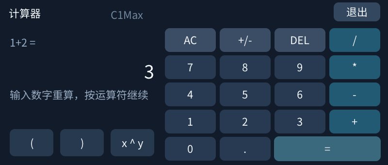</a><br>物理键盘操作的四则运算界面。</td>
  </tr>
  <tr>
    <td><strong>钢琴</strong><br><a href="docs/screenshots/piano.png">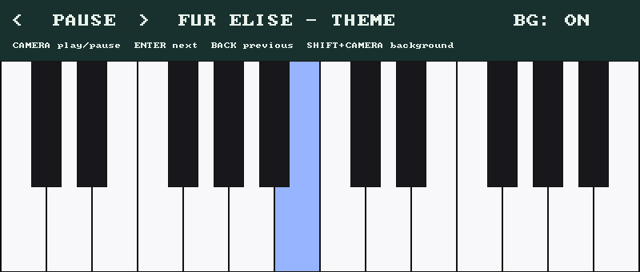</a><br>经典旋律自动演奏、琴键高亮与可选后台播放。</td>
    <td><strong>终端与 Linux 工具</strong><br><a href="docs/screenshots/terminal.png">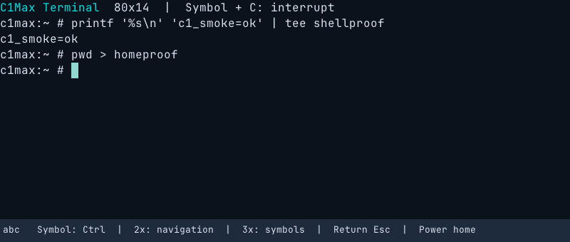</a><br>交互式 shell；另附 bash、less、nano、SSH 等常用工具。</td>
  </tr>
  <tr>
    <td><strong>五子棋</strong><br><a href="docs/screenshots/gomoku.png">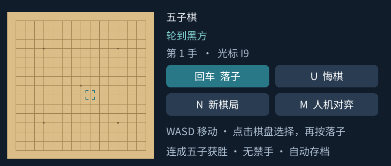</a><br>人机／双人对局、悔棋与自动续局。</td>
    <td><strong>NES 游戏</strong><br><a href="docs/screenshots/nes.png">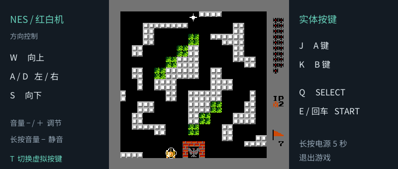</a><br>当前图为设备端渲染／输入自测；运行游戏需自行准备 `.nes` 文件。</td>
  </tr>
  <tr>
    <td><strong>PCSX4all</strong><br><a href="docs/screenshots/pcsx4all.png">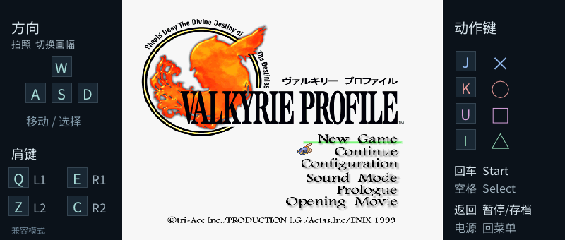</a><br>PS1 游戏运行画面示例，游戏镜像不随仓库发布。</td>
    <td><strong>DOSBox</strong><br><a href="docs/screenshots/dosbox.png">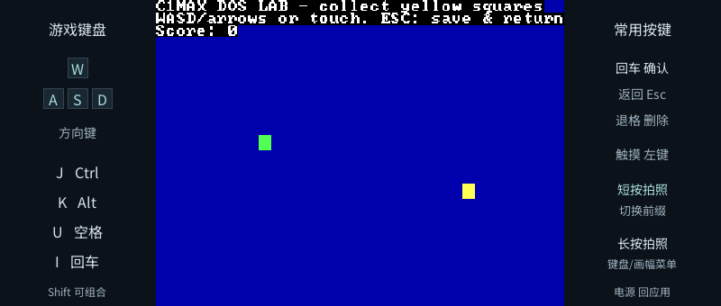</a><br>DOS LAB 正在运行；4:3 游戏区周围保留设备按键提示。</td>
  </tr>
  <tr>
    <td><strong>Processing</strong><br><a href="docs/screenshots/processing.png">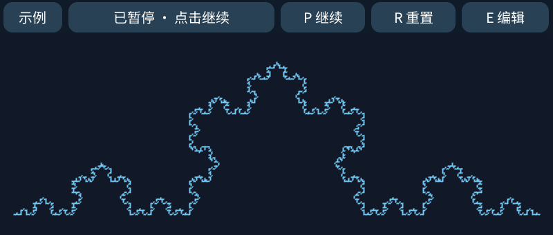</a><br>Processing 风格的绘图示例与 sketch 控制栏。</td>
    <td><strong>Airtune 网络电台</strong><br><a href="docs/screenshots/airtune.png"></a><br>本地收藏、自定义电台地址与音量显示；<a href="airtune/README.md">使用说明</a>。</td>
  </tr>
  <tr>
    <td><strong>CrossPoint 电子书</strong><br><a href="docs/screenshots/crosspoint.png">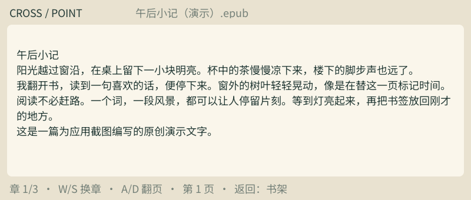</a><br>OPDS 下载、按章阅读与实体组合键调字号；<a href="crosspoint/README.md">格式和按键说明</a>。</td>
    <td><strong>拍立得</strong><br><a href="docs/screenshots/camera-preview.png">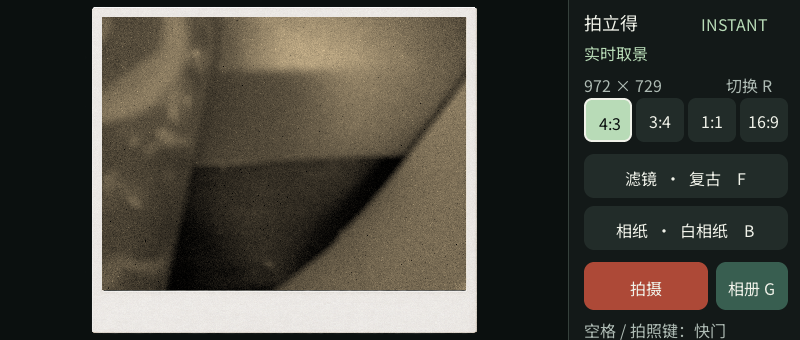</a><br>实时滤镜、四种画幅、相纸边框和相册管理；<a href="camera/README.md">拍摄说明与相纸截图</a>。</td>
  </tr>
  <tr>
    <td><strong>邮件</strong><br><a href="docs/screenshots/mail.png">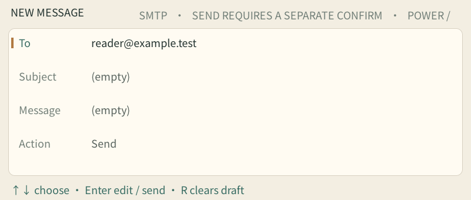</a><br>实体键盘编写纯文本邮件；<a href="mail/README.md">配置与支持范围</a>。</td>
    <td><strong>Launcher 第二页</strong><br><a href="docs/screenshots/launcher-apps.png">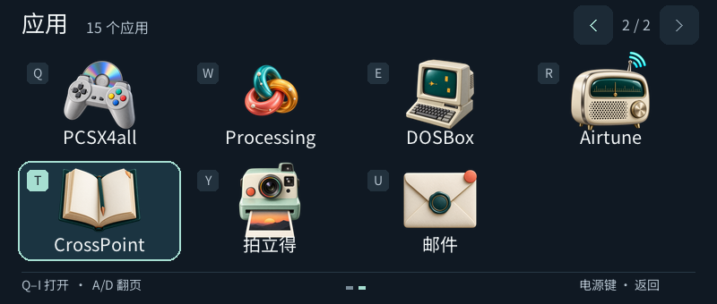</a><br>A/D 或横向滑动翻页，进入新增应用。</td>
  </tr>
  <tr>
    <td><strong>Bilibili</strong><br><a href="docs/screenshots/bilibili.png"></a><br>联网热门、搜索、分 P 和扫码登录；<a href="bilibili/README.md">功能与限制</a>。</td>
    <td><strong>Bilibili 播放控制</strong><br><a href="docs/screenshots/bilibili-playback.png">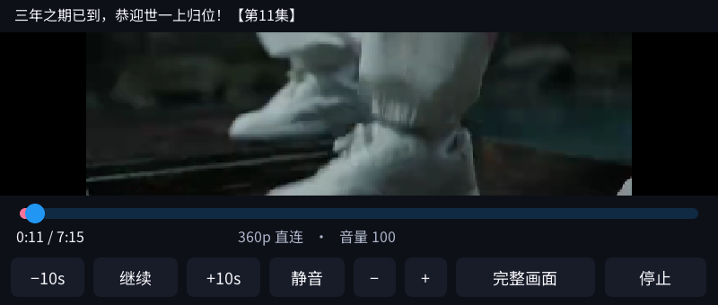</a><br>原始 360p MP4 直连播放；暂停、跳转和完整画面模式。</td>
  </tr>
  <tr>
    <td><strong>HIDPilot 键鼠</strong><br><a href="docs/screenshots/hidpilot.png"></a><br>USB HID 与 ADB 共存；<a href="hidpilot/README.md">使用说明</a>。</td>
    <td><strong>MoonPilot AI</strong><br><a href="docs/screenshots/moonpilot.png"></a><br>主机设置、PIN 配对和模型接口；真实 Sunshine 串流待接入验证。</td>
  </tr>
  <tr>
    <td><strong>设置</strong><br><a href="docs/screenshots/settings.png"></a><br>分类栏与可触摸的亮度 −／+；<a href="settings/README.md">按键与功能说明</a>。</td>
    <td><strong>设置 · 添加网络</strong><br><a href="docs/screenshots/settings-wifi-add.png"></a><br>实体键盘输入，拍照键显示密码，连接结果在底栏提示。</td>
  </tr>
</table>

| Tox 聊天 | Tox 扫码添加 |
| --- | --- |
| [](docs/screenshots/tox.png) | [](docs/screenshots/tox-qr-confirm.png) |

Tox 截图使用专用测试身份；功能、按键与验证范围见 [Tox 说明](tox/README.md)。

| 应用商店 | Tox 录音附件 |
| --- | --- |
|  |  |

## 构建、同步与启动

可独立克隆此仓库；在主仓库中它位于 `apps/` submodule。以下命令从本仓库根目录执行（在主仓库先 `cd apps`）。

主机需要 Docker、Python 3.12+、Git、curl 和 adb，截图另需 ffmpeg。无需旧的 Lima VM 或特定开发者绝对路径。

```sh
./tools/build.sh
python3 ./tools/deploy.py --serial MagicPen-931f06 --start
```

默认构建与打包只包含公开应用，并排除 Git 忽略的本地素材。可选的本地应用通过 `./tools/build.sh --local` 启用：`config/apps.local.cmake` 添加构建目标，`config/dependencies.local.json` 提供额外依赖（不可覆盖公开版本），`config/Dockerfile.local` 扩展工具链。`config/package.local.py` 接收 `root`、`payload`、`catalog` 三个变量，可添加本地安装文件与清单；这些配置均被 Git 忽略。单独打包使用 `python3 tools/package.py --local`，本地清单只写入 `.build/device/catalog.json`，不会覆盖公开的 `catalog.json`。

构建固定 LVGL / InfoNES / PCSX4all / DOSBox Pure 的提交及 QuickJS / zlib 源码校验值，编译静态 MIPS ELF，生成运行包。部署先传到新的 release 目录、逐文件校验 SHA-256，再通过 `rename(2)` 原子切换 `current`。保留旧版本，不覆盖用户数据；运行中的 launcher 必须先退出。

```text
/storage/apps/
├── current -> releases/<时间-校验值>/
├── releases/<版本>/
│   ├── launcher/{c1max-launcher,run.sh,apps.txt,desktop-service.sh,icons/,manifest.json}
│   ├── streamplayer/c1max-streamplayer
│   ├── calendar/c1max-calendar
│   ├── calculator/c1max-calculator
│   ├── settings/c1max-settings
│   ├── terminal/{c1max-terminal,assets/}
│   ├── linux-tools/{bin/,share/}
│   ├── gomoku/c1max-gomoku
│   ├── pcsx4all/{c1max-pcsx4all,c1max-psx-core,licenses/}
│   ├── dosbox/{c1max-dosbox,c1max-dos-core,C1LAB.COM,licenses/}
│   ├── processing/{c1max-processing,api.js,examples/,licenses/}
│   ├── bilibili/       B 站热门、搜索、分 P、扫码登录与 360p MP4 直连播放
│   ├── hidpilot/{c1max-hidpilot,c1max-hidpilot-usb}
│   ├── moonpilot/c1max-moonpilot
│   ├── tox/{c1max-tox,bootstrap.json,licenses/}
│   ├── airtune/c1max-airtune
│   ├── crosspoint/c1max-crosspoint
│   ├── camera/c1max-camera
│   ├── mail/c1max-mail
│   ├── piano/c1max-piano
│   ├── nes/c1max-nes
│   ├── shared/{字体,CA证书,c1max-activate,c1max-volume,c1max-power-guard,c1max-capture}
│   └── catalog.json
└── data/
    ├── launcher/      锁、运行日志
    ├── streamplayer/  config.json 登录令牌（0600）
    ├── calendar/      本地数据库、订阅缓存、导出 ICS
    ├── terminal/      shell HOME 与历史
    ├── gomoku/        自动续局
    ├── pcsx4all/      自备游戏、BIOS、记忆卡和即时存档
    ├── dosbox/        DOS 游戏完整目录、设置与游戏存档
    ├── processing/    my-sketch.js 用户程序
    ├── bilibili/       B 站热门、搜索、分 P、扫码登录与 360p MP4 直连播放
    ├── hidpilot/      USB 运行日志与旧版私有设置
    ├── moonpilot/     模型设置、主机配对证书（0600）
    ├── tox/           身份私钥及备份、好友和聊天记录（0600）
    ├── airtune/       本地电台列表与分类缓存
    ├── crosspoint/    books/ 本地书籍、OPDS 服务器与字号设置
    ├── camera/        photos/ 拍摄照片、画幅/滤镜/相纸设置
    ├── mail/          邮箱服务器及认证信息（0600）
    ├── default-servers.json  单独部署的私有默认服务器（0600）
    ├── calculator/
    ├── settings/      brightness 亮度（c1max-volume 唤醒时读取）
    └── nes/roms/      自备合法 .nes 文件
```

已部署后重新打开：

```sh
adb -s MagicPen-931f06 shell 'nohup setsid /storage/apps/current/launcher/run.sh </dev/null >/storage/apps/data/launcher/run.log 2>&1 & sleep 1'
```

设备端快捷入口：安装后，在原装界面按住 **Shift＋右下角回车至少 1.5 秒（到点触发，不用松手）**。短按不触发。安装命令：

```sh
python3 ./tools/hotkey_service.py install --serial MagicPen-931f06
# 禁用快捷键并移除下次启动的服务定义：
python3 ./tools/hotkey_service.py remove --serial MagicPen-931f06
```

安装器为 `/etc/init.rc` 追加独立 `c1apps-hotkey` 服务及 smartUI 运行时触发器，先备份、校验并原子写入，随后把系统分区恢复只读；不修改永久 ADB 脚本。当前运行直接启动热键监听，开机服务定义在下次启动载入。设备备份在 `/storage/apps/backups/hotkey-*/init.rc.before`，主机备份在 `.runtime/backups/`。常驻监听不抢占键盘，退出 launcher 后继续可用。

普通自定义应用短按电源键回 launcher；游戏模拟器短按显示长按提示，按住五秒退出；launcher 短按电源回原装桌面。进入自定义应用会真正停止 `smartUI` 和其中的原装界面，释放其内存；媒体、网络和 ADB 服务保留。监督器负责正常退出、launcher 崩溃后的原状态恢复。不要直接停掉监督器，也不要直接运行多个 framebuffer 应用。详见 [前台恢复边界](launcher/foreground-notes.md)。原装桌面增加图标需要另外接入厂商菜单；本次没有修改原装桌面二进制，也没有开机替换原桌面。

## 应用商店与更新

新版 launcher 的“应用商店”使用公开的 [store/catalog.json](store/catalog.json)，从 GitHub Releases 下载选中的一个应用包。未安装或不需要的应用不会自动下载／更新；已安装应用可控制首页显示。安装前验证 SHA-256，完整校验后再原子切换，旧版本及用户数据保留。

版本较旧时拒绝降级；同版本而构建不同会明确提示并要求用户确认。Launcher、字体和公共运行时仍由基础安装维护，不能在商店中卸载。首次从旧版升级需要电脑部署一次基础包。详见 [应用商店](appstore/README.md)。

原 `catalog.json` 与 `streamplayer --updates` 仍提供兼容的只读版本检查，不执行安装。

## 验证

```sh
./gomoku/tests/run.sh
./calculator/tests/run.sh
sh ./calendar/tests/run.sh
./streamplayer/tests/run.sh
./tests/run-hotkey.sh
bash ./tests/run-keymap.sh
sh ./terminal/tests/run.sh
sh ./dosbox/tests/run.sh
# 设备上执行构建生成的 c1max-api-test：清单/版本/URL 校验
```

StreamPlayer 的 Emby 实机结果与未迁移部分见 [播放器说明](streamplayer/README.md)。日历/计算器各有独立模型测试。NES 需要自备 ROM，已加入 WASD/J/K 物理按键；2026-10-02 用自制游戏 Alter Ego（mapper 0）在真机确认标题、关卡和暂停菜单正常显示，商业 ROM 兼容性仍需用户自测。

DOS 的导入与键盘说明见 [DOSBox](dosbox/README.md)。PS1 的镜像路径、按键和兼容性见 [PCSX4all](pcsx4all/README.md)，绘图语言的支持范围与示例来源见 [Processing 2D](processing/README.md)。

全局物理键盘、Shift 与音量键说明：[键盘映射](docs-keyboard.md)。

新增应用规划及开源 B 站方案：[ROADMAP.md](ROADMAP.md)。图标由 imagegen 生成，原始 PNG 与完整提示词保存在 [launcher/assets](launcher/assets/)。当前待验收项见 [VALIDATION.md](VALIDATION.md)。

### 私有默认服务器

StreamPlayer 与 CrossPoint 的默认地址、账号配置放在 Git 忽略的 `config/default-servers.local.json`。仓库仅包含空白示例；部署时单独同步到设备 data 目录，不进入公开应用包，也不覆盖应用已有设置。详见 [配置说明](config/README.md)。
