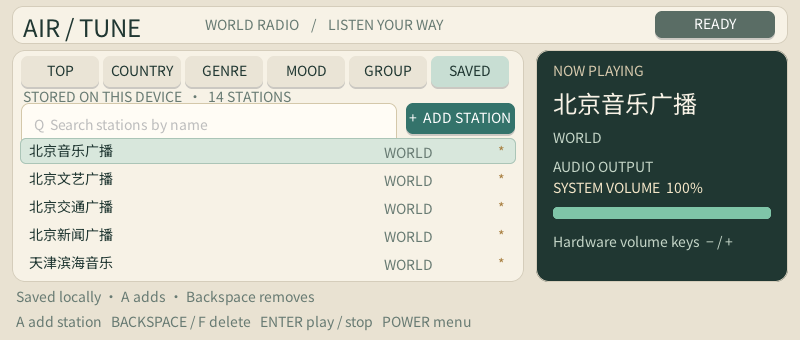

# Airtune

Native C1 Max internet-radio app with a tactile tuner interface. It reads public station metadata from Radio-Browser, which Airtune itself names as the source for station metadata. Station audio is opened directly from the station's published stream URL by the system MPlayer; the app does not relay audio through Airtune.

## Device screenshot

C1 Max framebuffer capture of the local SAVED list, populated with the app's built-in station presets. Directory categories and manually added streams use the same interface. The screenshot was taken without starting playback.

Controls: `R` reloads directory data, `Q` searches by name, arrows/WASD change selection, and Enter starts or stops playback. `F` adds or removes the selected directory station from the local **SAVED** list. In **SAVED**, press `A` to add a station by entering its name and HTTP(S) stream URL; select any row and press Backspace or `F` to delete it. Saved entries are stored with their names and URLs in `/storage/apps/data/airtune/saved-stations.json`, so playback and editing do not depend on Radio-Browser. The first upgrade seeds the list with the 14 supplied stations and imports old UUID favorites when Radio-Browser can resolve them. The physical power key returns to the launcher.

The app does not log in to Airtune or depend on an undocumented Airtune API. It requests the public Radio-Browser search endpoint and sends the documented UUID click request when a station is started. Starting the app only loads station metadata; it does not start audio automatically.

Country and genre lists are cached in the app's private data directory. Airtune shows the cache immediately; entries stay fresh for six hours, then refresh in the background. Changed lists replace the view, while identical results do not redraw it. Press `R` to force an immediate refresh. The right panel shows the selected/on-air station and system volume; it does not imply a playback queue. Direct stream playback uses a smaller MPlayer startup cache to reduce waiting; this gives up some buffering headroom on unstable connections.
