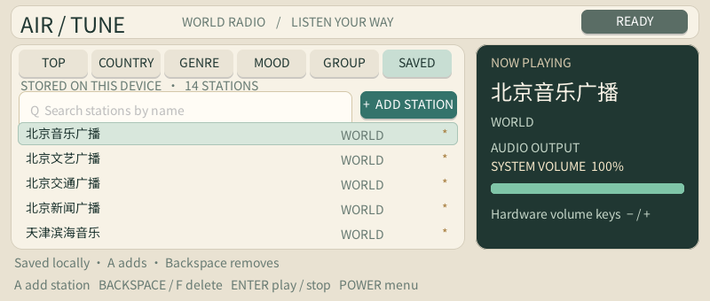

# Airtune

Native C1 Max internet-radio app with a tactile tuner interface. It reads public station metadata from Radio-Browser, which Airtune itself names as the source for station metadata. In local mode, system MPlayer opens the station's published stream URL. In remote mode, the selected receiver reads that URL instead; neither path relays audio through the Airtune website.

## Device screenshot

C1 Max framebuffer capture of the local SAVED list, populated with the app's built-in station presets. Directory categories and manually added streams use the same interface. The screenshot was taken without starting playback.

Controls: `R` reloads directory data, `Q` searches by name, arrows/WASD change selection, and Enter starts or stops playback. `F` adds or removes the selected directory station from the local **SAVED** list. In **SAVED**, press `A` to add a station by entering its name and HTTP(S) stream URL; select any row and press Backspace or `F` to delete it. Saved entries are stored with their names and URLs in `/storage/apps/data/airtune/saved-stations.json`, so playback and editing do not depend on Radio-Browser. The first upgrade seeds the list with the 14 supplied stations and imports old UUID favorites when Radio-Browser can resolve them. The physical power key returns to the launcher.

The app does not log in to Airtune or depend on an undocumented Airtune API. It requests the public Radio-Browser search endpoint and sends the documented UUID click request when a station is started. Starting the app only loads station metadata; it does not start audio automatically.

Country and genre lists are cached in the app's private data directory. Airtune shows the cache immediately; entries stay fresh for six hours, then refresh in the background. Changed lists replace the view, while identical results do not redraw it. Press `R` to force an immediate refresh. The right panel shows the selected/on-air station and system volume; it does not imply a playback queue. Direct stream playback uses a smaller MPlayer startup cache to reduce waiting; this gives up some buffering headroom on unstable connections.

## Search and background audio (0.3.0)

Touching/focusing the search field now enters text editing: W/S and all other letters are entered literally, including while a directory request is finishing. Async list redraws preserve the draft; Back cancels editing and restores list navigation. No virtual keyboard is used.

The right panel has Pause/Resume, Stop, and a persistent **Background** switch (off by default). Space pauses/resumes; B toggles background outside text fields. With background enabled, Power returns to the launcher while a small independent audio worker keeps playing; reopening Airtune reconnects to that worker. A new station/music source replaces the old one. Games and other exclusive audio apps, or completely leaving the custom desktop, stop background audio. Connecting/playing/error now come from the player process, replacing the old fixed 6.5-second assumption. The worker keeps the device awake only while audio is active; the saved screen timeout is unchanged.

`c1max-airtune-focus-test` runs the actual LVGL event/key handlers under QEMU and covers touch focus, W/S typing, async redraw, backspace and returning to navigation. Shared audio lifecycle tests: `tests/run-audio.sh` in the Linux builder.

## Output modes and casting

In **Settings → Wireless casting**, connect a Google Cast or DLNA receiver, then choose Airtune's own **Local / Remote / Both** output preference. It defaults to Local and is read when starting the next station, without moving an existing session.

| Mode | C1 Max | Receiver |
| --- | --- | --- |
| Local | Station interface and local sound | No media sent by Airtune |
| Remote | Station interface and playback controls | Station audio and title |
| Both | Station interface and playback controls, silent locally | Station audio and title |

For radio, Remote and Both intentionally use one audible endpoint. Both does not create a second local player or mirror the tuner interface onto the TV. The receiver decides how to display the station title and other media information. Pause/Resume, Stop and the existing optional Background switch continue to work through the shared audio service. Starting a new music/radio source replaces its previous source.

The receiver must be able to reach and decode the station URL. No receiver, a failed load or a lost connection produces an error and stops playback; it never unexpectedly enables the C1 Max speaker. To return to local audio, choose Local in Settings and start the station again. Physical volume keys and the three-second volume-down mute notify the active receiver when it provides volume control; a disconnected receiver may briefly retain its own buffered audio.

A Mac running Kodi with its UPnP/DLNA renderer enabled can receive radio without the game bridge service. AirPlay/Apple TV and full-interface mirroring are not implemented. Protocol limits, privacy and verification boundaries are documented in [Wireless casting](../docs/casting.md).

## 中文输入

已接入本地 Rime 拼音。适用字段、实体按键、中文搜索和草稿确认规则见[统一中文输入说明](../docs/chinese-input.md)。
