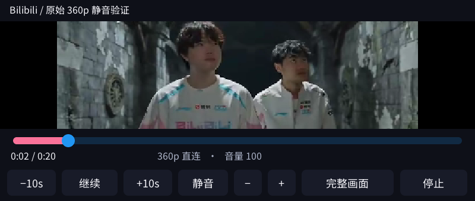

# Bilibili / C1 Max

参考 [wiliwili](https://github.com/xfangfang/wiliwili) 的 B 站接口、WBI 签名和扫码登录流程，为 C1 Max 编写的轻量 LVGL 客户端。它不是 wiliwili 完整移植，不需要浏览器、Python 或自建转码服务器。

## 首版功能

- 热门列表、关键词／BV 号／视频链接搜索、视频详情与分 P。
- 每页三张封面，后台加载；最多缓存 60 张 192×108 PNG，不整库下载；热门首页保留上次目录，刷新失败时仍可显示。
- 手机哔哩哔哩扫码登录：等待扫码、手机确认、过期／刷新、退出账号。
- 本机收藏与最近观看，各最多 100 条；与 B 站账号收藏、历史相互独立。
- 优先请求 **360p 单文件 H.264/AAC MP4**，设备直接连接 B 站 CDN 并解码，无服务器转码。
- 默认填满宽度，可切换完整画面；暂停、进度拖动、±10 秒／±1 分钟、音量与静音、自动隐藏控制条。
- 网络失败、权限限制和接口风控显示错误，不当成空列表。

## 按键

| 场景 | 操作 |
| --- | --- |
| 所有页面 | 电源回 Launcher；中间返回键返回上一级 |
| 浏览 | W/S 切分类；A/D 翻页；J/K 选视频；Enter 打开；R 刷新 |
| 搜索框 | 实体键输入，右上 Backspace 删除；Enter 搜索；返回结束输入；双击 Shift 大写 |
| 详情 | W/S 选分 P；Enter 播放；F 加入／移除本机收藏 |
| 收藏／历史 | Backspace 删除选中条目 |
| 账号 | Enter／R 生成或刷新二维码 |
| 播放 | Enter／空格暂停；A/D ±10 秒；Q/E ±1 分钟；F 切画面；H 显隐控制条；V 静音；实体音量键有效；返回停止 |

## 播放与限制

使用原厂 MPlayer 和 StreamPlayer 的完整帧适配器，MPlayer 不直接写 framebuffer；客户端统一合成视频和控件。`C1_YUV_SCALE` 只在本应用的播放器子进程启用，将原始 360p 画面缩至最多 400×288 再传给显示端；源尺寸限制为每边不超过 960、总像素不超过 307200。StreamPlayer 的原有转码尺寸校验保持不变。

首版只支持 B 站返回的单文件 360p MP4。DASH-only、多段 durl、番剧专用播放接口、付费／地区限制、直播、弹幕、评论、关注动态、云端收藏和 B 站字幕尚未实现。不会绕过登录、付费或地区权限。自动 Cookie 刷新未实现，登录过期时需重新扫码。

静音本地原始 640×360 H.264/AAC 测试约 28–29 fps；客户端 RSS 约 4.3 MB，**不含 MPlayer**。该测试不等于网络连续播放或有声同步验收；不同片源的码率、帧率和网络状况会影响流畅度。详细验证记录见 [QA](../docs/2026-09-26-bilibili-qa.md)。

## 配置、构建与隐私

数据目录 `/storage/apps/data/bilibili/`：`session.json` 保存扫码登录 Cookie（0600），`library.json` 保存本机收藏／历史，`posters/` 保存封面，`home.json` 保存热门目录缓存。没有预置账号或服务器。账号 Cookie 只发送到 B 站 API／Passport，封面和视频 CDN 不接收 Cookie；不会将带鉴权参数的视频直链写进应用日志。

```sh
./tools/build.sh
# API 回归（构建容器里；测试专用依赖）
apt-get update && apt-get install -y gcc qemu-user wget
./bilibili/tests/run.sh
# 可选真实接口联测（需要 wget 和可用网络；不登录账号）
C1_APPS_ROOT=/work/.build/device C1_APPS_DATA=/work/.runtime/bilibili-qa qemu-mipsel .build/mips/c1max-bilibili-test --live
# 真机只读网络诊断：不输出 Cookie 或 CDN 地址
/storage/apps/current/bilibili/c1max-bilibili --probe
```

可用 `C1_BILI_SILENT=1` 临时将播放音频输出到 null。`--open BV...` 打开指定视频详情，不会自动播放。依赖同一个应用包里的 `streamplayer/c1max-yuv-pipe.so`、中文字体和系统音量监督器。

本应用采用 GPL-3.0-or-later；上游来源、版本和第三方许可见 [licenses/NOTICE.md](licenses/NOTICE.md)。透明 Launcher 图标使用内置 imagegen 生成，完整提示词见 [bilibili-prompt.json](../launcher/assets/bilibili-prompt.json)。

## 设备截图




以上为真实设备截图；首页是电脑获取后写入独立 QA 目录的真实热门缓存，播放图是原始视频的本地静音验证。设备网络连续播放待 Wi-Fi 恢复后验证。
