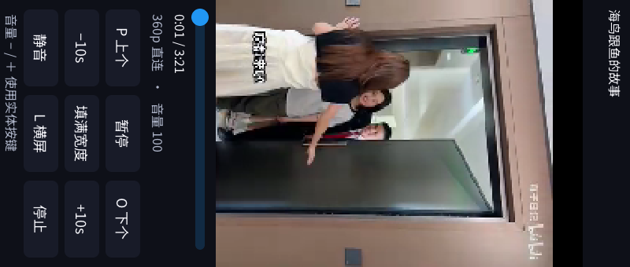

# Bilibili / C1 Max

参考 [wiliwili](https://github.com/xfangfang/wiliwili) 的 B 站接口、WBI 签名和扫码登录流程，为 C1 Max 编写的轻量 LVGL 客户端。它不是 wiliwili 完整移植，不需要浏览器、Python 或自建转码服务器。

## 功能

- 热门列表、竖屏精选、关键词／BV 号／视频链接搜索、视频详情与分 P。
- 每页三张封面，后台加载；最多缓存 60 张 192×108 PNG，不整库下载；热门首页保留上次目录，刷新失败时仍可显示。
- 手机哔哩哔哩扫码登录：等待扫码、手机确认、过期／刷新、退出账号。
- 本机收藏与最近观看，各最多 100 条；与 B 站账号收藏、历史相互独立。
- 优先请求 **360p 单文件 H.264/AAC MP4**，设备直接连接 B 站 CDN 并解码，无服务器转码。
- 默认填满宽度，可切换完整画面；暂停、进度拖动、±10 秒／±1 分钟、音量与静音、自动隐藏控制条。
- L 将视频、文字和触摸控件一起右转 90°，竖屏控件位于设备横放时的屏幕左侧。P／O 直接播放当前列表的上一个／下一个视频，保留方向和缩放模式，切换期间不返回列表，新视频开始后隐藏控件。
- 网络失败、权限限制和接口风控显示错误，不当成空列表。
- 0.3.0 增加「仅本机／仅远端／双屏」输出选择，支持已连接的 DLNA／Google Cast 媒体接收器。

## 按键

| 场景 | 操作 |
| --- | --- |
| 所有页面 | 电源回 Launcher；中间返回键返回上一级 |
| 浏览 | W/S 切分类；A/D 翻页；J/K 选视频；Enter 打开；R 刷新 |
| 搜索框 | 实体键输入，右上 Backspace 删除；Enter 搜索；返回结束输入；双击 Shift 大写 |
| 详情 | W/S 选分 P；Enter 播放；P 上一个／O 下一个视频；F 加入／移除本机收藏；T 切换输出方式 |
| 收藏／历史 | Backspace 删除选中条目 |
| 账号 | Enter／R 生成或刷新二维码 |
| 播放 | L 切横竖屏（右转 90°）；P 上一个／O 下一个视频；Enter／空格暂停；A/D ±10 秒；Q/E ±1 分钟；F 切画面；H／点击画面显隐控件；V 静音；实体音量键有效；返回停止 |

“竖屏 · 热门精选”从每组三页热门数据（最多 60 条）中筛选高度大于宽度的视频，忽略尺寸未知的条目；它不是 B 站官方 Story 流。打开该分类中的视频时默认竖屏，播放中可用 L 自行切换。P／O 到达当前接口页边缘时继续请求相邻页；网络失败或取消会保留当前视频。切换只显示简短加载提示，Back 可以取消正在进行的切换。

当前设备固件没有暴露可用的 IMU／加速度计接口，因此采用手动旋转；这不代表已经确认主板上没有传感器。

## 投屏与双屏

先在系统「设置 → 无线投屏」选择接收器，再在 Bilibili 顶部点击「输出」，或在未输入文字、未播放时按 **T** 切换。选项单独保存到本机，下一个视频开始生效；默认仅本机。Mac 可使用已开启 DLNA 接收的 Kodi。

| 输出 | 本机 | 接收端与声音 |
| --- | --- | --- |
| 仅本机 | 原有视频与控件 | 不发送视频，不接管其他投屏 |
| 仅远端 | 常显播放控制页，不启动本机视频解码 | 原始 360p MP4，远端出声 |
| 双屏 | 本机视频与控件，音频输出关闭 | 同一 MP4，远端出声 |

暂停、继续、进度拖动、±10 秒／±1 分钟和停止同时控制活动的输出；P／O 切换视频会撤销上一个视频的转发地址。双屏先准备好本机时，暂停与跳转会等接收器就绪后发送。两个解码器独立读取网络流，**不是帧级同步镜像**，缓冲和延迟可能不同；本机先播完时保留最后一帧，等远端结束。L/F 的旋转、裁剪只改变本机画面，电视按原始视频比例显示。

没有连接接收器、远端加载失败或断开时会明确提示，并停止当前播放；点击顶部输出或按 T 切回仅本机，再按 Enter 重试。不会在断线时突然从本机扬声器发声。返回／电源离开应用会停止它拥有的远端内容并关闭转发；其他应用接管接收器后，本应用不再继续播放旧内容。

B 站 CDN 通常需要 Referer，普通 DLNA 接收器无法自行附加。因此投屏期间 C1 Max 提供只转发**当前单文件 MP4** 的小型 HTTP 服务，正确携带 Referer，支持 GET、HEAD 和单区间 Range，不缓存整部视频。上游 CDN 使用验证证书的 HTTPS；设备到接收器在局域网使用 HTTP。双屏目前从 CDN 分别给本机和远端读取，网络用量会增加。

转发地址使用每段视频新生成的 192 位随机令牌，只接受已选接收器 IPv4 地址，最多三个并发请求；拒绝任意 URL、请求体、多区间 Range 和重定向，不附带账号 Cookie。上游响应头保留在有界内存中，仅向接收器提供必要的媒体长度／Range 信息；不输出 Cookie 或带签名的 CDN 直链到日志。临时配置／上游地址文件为 0600，停止时删除。地址只在应用播放期间有效，不提供公网代理服务。

该版本仍只接收 API 返回的单文件 360p H.264/AAC MP4，不新增 DASH、弹幕或字幕。Google Cast 接收软件必须支持启动默认媒体接收器；Apple TV／AirPlay 尚未接入。协议与设备兼容性见[无线投屏说明](../docs/casting.md)。

投屏回归使用真实 GNU wget、独立 HTTPS 测试源和可控接收状态，包含证书验证、Referer、Range、并发上限、输出隔离、静音双屏、异步控制和退出清理。它不代替真实电视播放测试：

```sh
./bilibili/tests/run-cast.sh
```

## 播放与限制

0.1.1 修复了原厂播放器没有给 HTTPS CDN 传递 Referer 导致的 403。真机还发现其 HTTPS 流在跳转时触发 SIGBUS；当前视频走同一 CDN 的原生 HTTP／Range 通道，视频传输不加密。账号登录、接口、封面仍用 HTTPS，CDN 请求不携带账号 Cookie。

使用原厂 MPlayer 和 StreamPlayer 的完整帧适配器，MPlayer 不直接写 framebuffer；客户端统一合成视频和控件。`C1_YUV_SCALE` 只在本应用的播放器子进程启用，将原始 360p 画面缩至最多 400×288 再传给显示端；源尺寸限制为每边不超过 960、总像素不超过 307200。StreamPlayer 的原有转码尺寸校验保持不变。

首版只支持 B 站返回的单文件 360p MP4。DASH-only、多段 durl、番剧专用播放接口、付费／地区限制、直播、弹幕、评论、关注动态、云端收藏和 B 站字幕尚未实现。不会绕过登录、付费或地区权限。自动 Cookie 刷新未实现，登录过期时需重新扫码。

真机已联网取得热门、搜索、详情、360p MP4、封面和登录二维码。原始 640×360 H.264/AAC 网络播放稳定段约 30 fps，用户确认有声音；客户端 RSS 约 4.3 MB，**不含 MPlayer**。网络偶有缓冲，尚未做长时间稳定性或精确音画同步测量；不同片源的码率、帧率和网络状况会影响流畅度。详细验证记录见 [QA](../docs/2026-09-26-bilibili-qa.md)。

## 配置、构建与隐私

数据目录 `/storage/apps/data/bilibili/`：`session.json` 保存扫码登录 Cookie（0600），`library.json` 保存本机收藏／历史，`posters/` 保存封面，`home.json`／`portrait.json` 保存热门／竖屏目录缓存。没有预置账号或服务器。账号 Cookie 只发送到 B 站 API／Passport，封面和视频 CDN 不接收 Cookie；不会将带鉴权参数的视频直链写进应用日志。

```sh
./tools/build.sh
# API 回归（构建容器里；测试专用依赖）
apt-get update && apt-get install -y gcc qemu-user wget
./bilibili/tests/run.sh
# 可选真实接口联测（需要 wget 和可用网络；不登录账号）
C1_APPS_ROOT=/work/.build/device C1_APPS_DATA=/work/.runtime/bilibili-qa qemu-mipsel .build/mips/c1max-bilibili-test --live
# 真机只读网络诊断：不输出 Cookie 或 CDN 地址
/storage/apps/current/bilibili/c1max-bilibili --probe
```

真机播放器回归可单独构建 `c1max-bilibili-player-test`：设置临时 `C1_APPS_DATA`，传入一个超过 90 秒的公开视频 BV 号。该程序实际连接 CDN、解码和测试暂停／跳转，始终静音，不访问 framebuffer 或键盘。运行前应通过前台监督器退出其他应用、停止原装桌面，以免并发解码耗尽内存；完成后恢复桌面。它不包含在应用包中。

`c1max-bilibili-cast-probe remote|both [BV-id]` 是独立的真实投屏联测目标：使用已选好接收器的临时 `C1_APPS_DATA`，不访问 framebuffer／键盘，本机解码始终 `-ao null`。缺省最多从前三个热门视频中选择一个可播放的公开 MP4，检查远端进度、仅远端模式零本机帧、双屏实际解码且本机静音、暂停／跳转／继续／停止；55 秒总预算，失败同样释放 Player 与转发。接收端可以出声，测试前先停止其现有播放。输出不记录视频标题、URL 或凭据。此目标不会随应用发布。

可用 `C1_BILI_SILENT=1` 临时将播放音频输出到 null。`--open BV...` 打开指定视频详情，不会自动播放。依赖同一个应用包里的 `streamplayer/c1max-yuv-pipe.so`、中文字体和系统音量监督器。

本应用采用 GPL-3.0-or-later；上游来源、版本和第三方许可见 [licenses/NOTICE.md](licenses/NOTICE.md)。透明 Launcher 图标使用内置 imagegen 生成，完整提示词见 [bilibili-prompt.json](../launcher/assets/bilibili-prompt.json)。

## 设备截图

0.2.0 增加竖屏播放：控件和文字一起右转，控制区在设备横放时的左侧；切换视频不返回列表，开始播放后隐藏控件。


以上为真实设备联网截图，数据保存在独立 QA 目录；播放图来自 B 站 CDN 原始码流，没有服务器转码。




[竖握方向查看](../docs/screenshots/bilibili-portrait-upright.png)。P/O 切换后默认隐藏控件，见[切换后的截图](../docs/screenshots/bilibili-next-hidden.png)；测试范围见 [0.2.0 QA](../docs/2026-09-27-bilibili-portrait-qa.md)。

## 中文输入

已接入本地 Rime 拼音。适用字段、实体按键、中文搜索和草稿确认规则见[统一中文输入说明](../docs/chinese-input.md)。

在线搜索若收到 B 站的网页验证要求，会明确显示验证提示，不再误报为空结果；本机收藏和历史筛选不受该远程限制影响。
