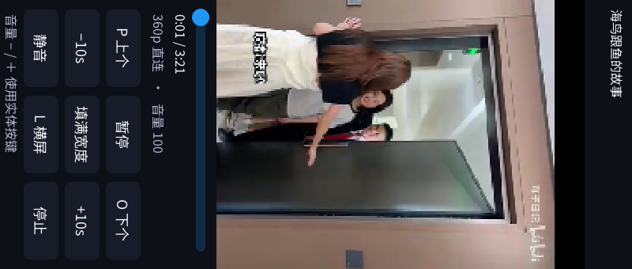

# Bilibili 0.2.0：横竖屏与视频切换

平台：C1 Max / X2000 / MIPS，原生 framebuffer 340×800，常用横屏 800×340。
本轮测试使用独立应用数据目录，没有登录 B 站账号；直接请求公开 API 和 CDN。

## 实现

- 竖屏精选按接口尺寸筛选 `height > width`，每次最多合并三页热门数据、60 条候选，按 BV 去重。未知尺寸与正方形不进入该分类；不是官方手机 Story 流。
- L 将视频、LVGL 文字、控件及触摸坐标一起右转 90°。竖屏逻辑尺寸 340×800，底部控制区在设备横放时位于左侧；不改 framebuffer 驱动模式、不重启解码器。
- P/O 播放当前列表上一条／下一条，跨接口页时先请求相邻页。保留方向、缩放模式；仅在新视频详情和播放地址都成功后更新当前条目。
- 切换请求期间保留旧视频画面，隐藏控制条，只显示短加载提示。下一条首帧到达后隐藏提示；H 或点击画面才显示控件。请求失败或取消会恢复旧视频之前的暂停状态。
- 浏览器和其他应用仍默认横屏。共享合成器的控制条边界可配置；StreamPlayer 的原有默认值不变。

## 自动检查

- MIPS 全应用构建通过；Bilibili 最新代码单独重建通过。
- `bilibili/tests/run.sh`：MIPS API 回归，以及原始 YUV／竖屏尺寸／缩放像素／超大输入拒绝测试通过。
- 新增 API 回归覆盖旋转后的尺寸、重复归一化、三页筛选去重、未知／横屏／方形排除、页码上界与最后一页。
- `streamplayer/tests/run.sh`：ASan/UBSan 视频、时间线、HLS、字幕和字幕 worker 测试通过。
- 新增显示回归遍历全部横竖屏触摸坐标的正反变换，检查旋转方向、竖屏像素位置、裁切／留黑、控制区、整屏遮罩、stride 填充和越界哨兵；返回横屏后与原裁切计算一致。

## 真机检查

- 原生 API 联测：热门 20 条、搜索 20 条、可用 360p 单文件播放源、封面、登录二维码等待态；竖屏精选首次返回 15 条，均满足高度大于宽度。
- 横屏与竖屏均观察到切换时的旧画面／加载提示，随后新视频继续播放、控件隐藏。H 显示控制条，竖屏触摸“上个／下个”能切换视频。
- L 双向切换时保留播放位置；暂停后旋转保持暂停。竖屏触摸暂停按钮有效；文字和操作区方向与视频一致。
- 使用单个前台 GUI 和单个解码会话测试，正常声音输出；稳定播放段约 25–30 帧/秒，取决于片源。未进行长时间耐久测试，也未把联网结果当作所有视频的兼容保证。
- 截图期间存在人工交互，早期混合操作的抓图不用于判断单次切换结果；文档采用后续明确状态的实机截图。
- 本轮没有在真机强制制造网络中断，也没有完整遍历所有远程页；取消／请求失败／跨页提交逻辑已检查，接口边界由自动回归覆盖。

实测二进制 SHA256：`be057ff08ceb2a7d4fddda7bd05f7472ca3e286d0377c6d70c4b198b4aef66ef`。

正式安装为 `/storage/apps/releases/20260927-021937-c7dd4de5`，已验证设备端版本为 0.2.0，二进制 SHA256 与实测包一致。公开清单含 16 个应用，本地安装保留 17 个入口；私有应用与私人服务器配置没有进入公开包。安装后 Launcher 正常启动。

## 传感器与限制

当前固件的 input 设备只有矩阵键盘、GPIO 按键和触摸屏；I2C 可见音频、触控、电源、摄像头及对焦器件，未发现可用 IIO／加速度计／陀螺仪接口。因此使用 L 手动旋转，不能据此断言主板没有 IMU 芯片。

沿用 0.1.1 的播放限制与传输策略：原厂 MPlayer 的 HTTPS seek 会崩溃，因此仅媒体使用同一 CDN 的 HTTP Range 通道；账号、API 和封面仍走 HTTPS，不向 CDN 发送登录 Cookie。详情见 [原播放 QA](2026-09-26-bilibili-qa.md)。

## 截图

可单独查看[竖握方向](screenshots/bilibili-portrait-upright.png)。图片来自 framebuffer；没有重绘应用界面。
