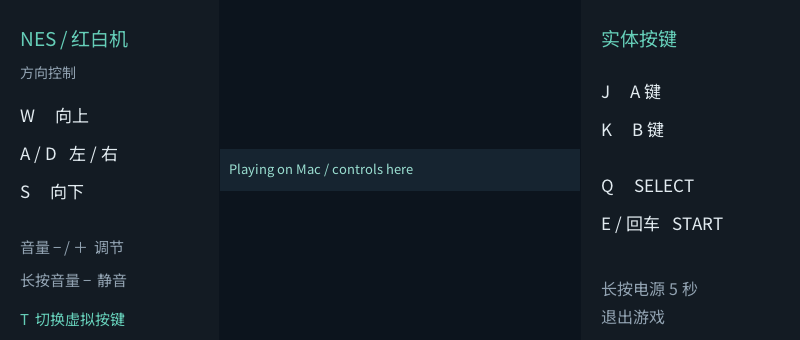
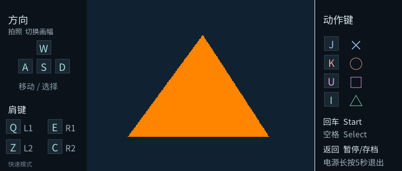
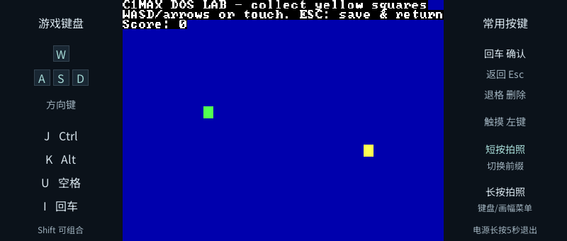
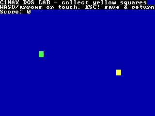

# 三种输出模式与 Mac 游戏桥接验证

日期：2026-10-10。设备为 C1 Max／Ingenic X2000，接收端为 MacBook 上的 Kodi DLNA renderer。游戏另运行已配对的 Mac 桥接与 FFmpeg。

这是[首轮媒体投屏验证](2026-10-10-casting-qa.md)之后的新增功能验证：每个应用分别保存仅本机、仅远端、本机＋远端。游戏使用 Mac 辅助编码，**没有重新启用曾导致设备重启的硬件编码器**。使用方法见[无线投屏与输出模式](casting.md)、[Mac 游戏桥接](../tools/cast-receiver/README.md)。

## 真机验证结果

| 项目 | 实际覆盖 | 结果与范围 |
| --- | --- | --- |
| Bilibili 仅远端 | 真实 Player、公开 B 站 MP4、受控转发、Kodi | 本机解码帧为零；远端进度推进；暂停保持、暂停中跳转、继续、停止均通过 |
| Bilibili 双屏 | 原厂 MPlayer 实际解码、受控转发、Kodi | 本机帧数增长；检查子进程确认为 `-ao null`；远端时间推进；暂停／跳转／继续／停止通过 |
| StreamPlayer 双会话 | 真机向 Emby 协商本机与电视两条 HLS 会话 | 两条输出均可读；停止本机会话后电视 TS 仍可读，停止电视会话后本机 TS 仍可读；精确会话清理通过 |
| NES 双屏 | 设备运行模拟器、Mac 桥接、Kodi | Kodi 进入播放；本机仍显示游戏，发送有效游戏区域 |
| NES 仅远端 | 同上，本机改为控制页 | 本机显示实体按键提示和远端播放状态；Kodi 进入播放 |
| NES 桥接故障 | 主动终止本次测试桥接 | 设备自动恢复本机游戏画面，而不是留在空白控制页 |
| PCSX4all 双屏 | `Triangle-Test` 自制测试程序、Mac 桥接、Kodi | 本机正常显示，Kodi 进入播放；取回实际 HLS 解码得到 4:3 游戏画面 |
| DOSBox 双屏 | 项目自带 C1Max DOS LAB、Mac 桥接、Kodi | 本机正常显示，Kodi 进入播放；取回实际 HLS 解码得到 4:3 游戏画面 |

Bilibili 使用独立 `c1max-bilibili-cast-probe`，不访问 framebuffer／键盘，真实网络、MPlayer、视频 FIFO、投屏 daemon 和接收器均参与测试。两种模式的全部检查阶段通过；不是只向假接收器发送控制消息。本机声音关闭由实际子进程参数确认，不把这次自动验证等同于人工听音评估。

StreamPlayer 本轮的真机新增验证是**网络会话隔离与清理**：不能据此宣称双屏完整 UI、两个画面的同步误差或字幕切换已完成真机验收。前一轮单路媒体投送结果单独记录在[首轮 QA](2026-10-10-casting-qa.md)。

## 画面记录

以下图片不含私有地址、令牌或商业游戏内容。本机图片为 C1 Max framebuffer 截图；标注“远端流”的图片为本次真实 HLS 解码帧，**不是对 Kodi 窗口或电视屏幕的拍照**。

### NES 仅远端：本机保留实体按键提示

中间显示远端播放状态，两侧保留方向、动作、开始／选择和退出提示；本机不显示被投送的游戏画面。

### PCSX4all：自制 Triangle-Test

远端只有 320×240 的游戏区域，没有词典两侧快捷键栏。两幅截图的采集时间不同，不用于证明帧同步。

### DOSBox：项目内置 DOS LAB

远端流保留游戏的 4:3 比例，不包含词典两侧的实体按键说明。本轮截图覆盖 4:3；没有把它当作 16:9 游戏布局的完整验收。

## 性能观察与限制

- 游戏桥接输出为 H.264 **320×240、20 fps**。一次运行中 Mac 实际收到的新画面约 **14 fps**，Mac 可重复最后一帧维持编码时间线；编码输出的 20 fps 不等于每秒收到 20 个新游戏画面，也不等于模拟器运行速度。
- NES 双屏的一段 **4981 毫秒采样**记录 `emulated_fps=60.23`、`vblanks=300`、`rendered=300`、`cast_attempts=100`、`local_video=1`、`local_audio=0`。这段样本中模拟器本身约 60 fps、以约 20 fps 尝试投送，本机画面保留且声音关闭；不能把 Mac 接收到约 14 fps 解释为 NES 只运行了 14 fps。
- 一次 NES 的 **5 秒采样**中，模拟器进程 CPU 约 **39.6%**、RSS 约 **3 MB**。这是单次、单进程观测，不含 Mac 编码开销，也不代表整机资源或所有 ROM 的长期性能。
- NES 原始媒体发送约 320×240×2×20 字节／秒，加 PCM 音频。实际无线网络较慢时丢弃旧视频帧，不以无限队列追赶历史画面。
- **Kodi／DLNA 的 HLS 有多秒缓冲，不适合依赖远端画面反应的动作游戏。** 没有完成精确端到端延迟测量；建议双屏时看词典操作，将远端用于观看。
- PS1 本轮为轻量自制测试程序，DOSBox 为项目内置测试游戏；没有宣称 FF7 或其他商业游戏的帧率、文字清晰度、音画同步和长时间稳定性全部合格。
- 没有复测独立 Google TV 的默认媒体接收应用；此前遇到的 `LAUNCH_ERROR / NOT_FOUND` 不在本轮中视为已解决。
- 没有实现或验收 Apple TV／AirPlay、完整桌面镜像、没有 Mac 的独立游戏编码、所有应用统一 framebuffer 镜像。
- Bilibili 双屏使用两个独立网络解码器；StreamPlayer 双屏使用两个服务器转码会话。都不能据此保证帧同步，网络、转码和接收缓存仍会造成差异。

## 可复现检查与数据保留

[Bilibili 的回归入口](../bilibili/tests/run-cast.sh)使用隔离容器与真实 GNU wget／TLS 测试源，覆盖 GET／HEAD／Range、Referer、证书拒绝、IP／令牌、三请求上限、取消、临时文件清理，以及可控接收状态下的 Player 生命周期。相关实现与真实 probe 用法见 [Bilibili README](../bilibili/README.md)。

整合后的设置与 StreamPlayer 两项 QEMU 输入／界面回归，以及 NES core 回归通过；它们仍不代替完整真机 UI 流程。

游戏客户端的接管／回退、缓冲、帧格式和阻塞检查在 `shared/game_cast_tests/run.sh`；Mac 服务的真实 FFmpeg 编码、HTTP Range、令牌和断开清理在 `tools/cast-receiver/tests/server_test.py`。这些自动化检查与上面的真机结果分别记录，不相互替代。

原始诊断、接收器发现结果和测试文件保存在本地忽略目录 `.build/cast-output-20261010/`；其中可能包含临时媒体地址或配对信息，**不提交原始日志和私有 JSON**。公开归档仅包含本页文字与上面五张经过检查的画面。
