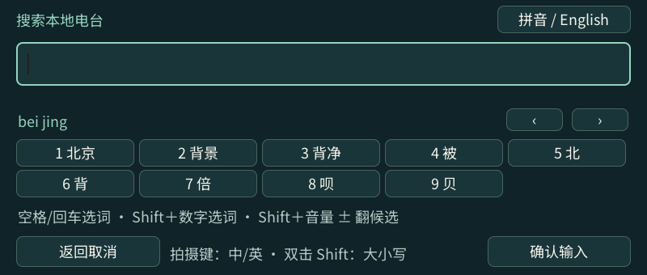
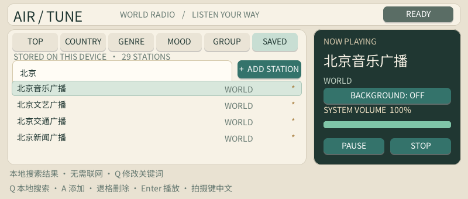
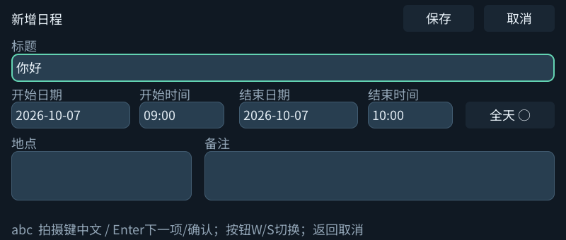
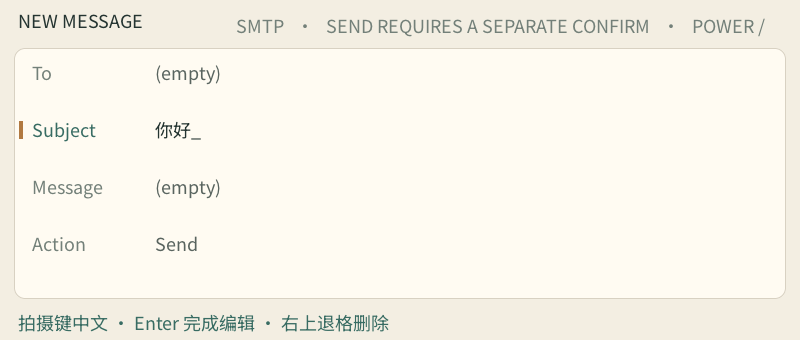

# 中文输入与中文搜索

除终端和 CrossPoint 的既有搜索框外，需要文字的应用共用一个轻量 Rime 拼音编辑器。只显示草稿、拼音和候选，不弹出虚拟键盘；确认后关闭输入法并释放会话。每个应用包自带预编译词库，单独安装时无需依赖 Terminal，设备也不现场编译词库。

## 操作

1. 选中输入字段，按实体**拍摄键**打开中文编辑；StreamPlayer 媒体库直接按 **F** 搜索。
2. 输入拼音。**空格/回车**选首项，**Shift＋Q～O**输入数字 1～9 选对应候选，也可以触摸候选。
3. **Shift＋音量 ＋/−**切换上一页/下一页候选，也可点击 `‹ / ›`。
4. 拼音已确认后，再按**回车**或点“确认输入”，把完整草稿填回原字段。搜索、发送、保存仍由原界面的相应操作触发；StreamPlayer 的搜索编辑器确认即执行搜索。
5. **拍摄键**切换拼音/英文；英文状态下双击 Shift 切换大小写。**右上退格**删除拼音或一个完整汉字；**中间返回**先取消正在组合的拼音，再按一次放弃草稿。电源键退出应用。

异步目录/聊天刷新不会覆盖中文草稿或把焦点移到其他字段。候选尚未确认时，回车只选词，不发送消息。地址、端口、ID、密码和密钥继续使用原来的直接输入方式；密码不会进入拼音学习词库。

## 已接入的字段

| 应用 | 中文输入与搜索 |
| --- | --- |
| Airtune | 在线电台搜索、本机 SAVED 电台筛选、新增电台名称。SAVED 中按 Q 输入关键词并回车，完全在本机匹配名称；空关键词恢复全部，H/L 或触摸切换目录。 |
| StreamPlayer | 用户名、当前媒体库的视频/音乐搜索。F 输入关键词，A/D 翻结果页；切换库清除搜索，返回或“清除”回普通列表。音乐播放队列沿用搜索条件。 |
| Bilibili | 在线关键词搜索；本机收藏和观看记录按 F 筛选标题/作者。筛选本机列表不请求服务器，缺封面时使用占位图；在筛选结果删除只删除对应视频。 |
| Tox | 聊天草稿、我的昵称。聊天中拍摄键打开中文输入；拍照使用“拍照”按钮，取景内拍摄键仍用于拍照；扫码页按键保持不变。确认中文只填入草稿，仍需另按回车发送。 |
| 邮件 | 主题、正文、账户用户名。J/K 选择字段、回车进入编辑后按拍摄键；确认中文不发送邮件。 |
| 日历 | 日程标题、地点、备注和 ICS 订阅名称。输入完成后仍通过日程的保存按钮持久保存。日期/时间/订阅地址保持直接输入。 |
| 设置 | 隐藏 Wi-Fi 的网络名称、语音模型名称。SSID 最多 32 个 UTF-8 字节，超限时保留草稿并提示缩短；退格整字删除。密码字段的拍摄键仍用于显示/隐藏密码。 |
| MoonPilot | 任务描述、文字对话草稿、模型名称。焦点在文字框时拍摄键打开输入法；确认文字不启动模型、发送对话或执行远程操作。 |
| CrossPoint | OPDS 搜索已有内联拼音；书库名称、用户名新增共享编辑器。 |
| Terminal | 保留现有 `双击 Shift：小写 → 大写 → 拼音` 循环，以及内联候选，避免改变 Shell 的符号/控制键操作。 |

拼音在设备本地运行。中文确认后，在线搜索才通过原有远程接口传送关键词；Airtune 的本机筛选和 Bilibili 的本机筛选不联网。StreamPlayer 使用 [Emby Items SearchTerm](https://dev.emby.media/reference/RestAPI/ItemsService/getUsersByUseridItems.html) / Jellyfin 同名接口参数，按 UTF-8 编码，并保留当前库、分页与媒体类型过滤；搜索结果取决于服务端索引，不在本机下载整个媒体库。

## 真机界面

## 验证

`c1max-text-input-test` 使用真实 Rime 和 LVGL，覆盖选词/确认分离、取消、异步底层重绘、中文退格、字节限制、中英文切换、退出及缺词库回退。各应用 `*-input-test` 直接运行实际输入处理函数，验证草稿回填且不触发发送或保存。Airtune focus test 额外覆盖本地中文筛选，Bilibili input test 覆盖筛选后按视频 ID 删除；StreamPlayer music API 测试验证中文查询编码、分页及队列查询条件。

真机 Emby 的中文电影/音乐搜索、Airtune 在线/本地中文搜索通过。Bilibili 本次在线搜索触发服务端网页验证，应用显示实际限制；不能据此记为已取得在线搜索结果。没有独立 Jellyfin 服务器联测。
