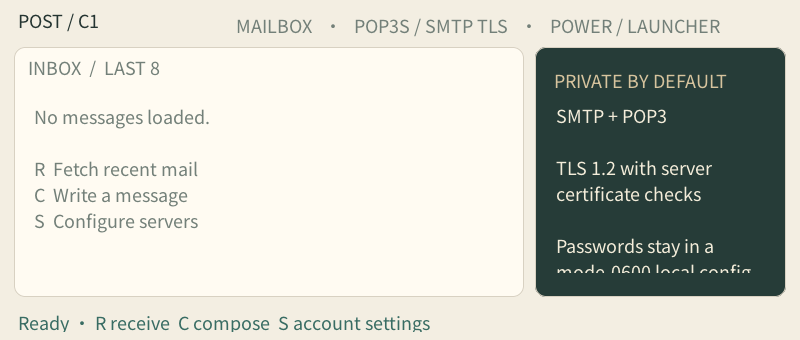
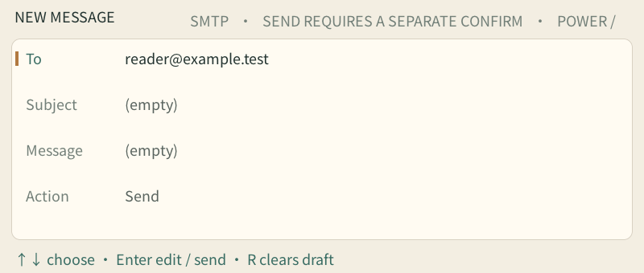

# Mail

Native C1 Max mail client with a physical-key-only inbox, account editor, and message composer. It supports POP3S on port 995 or POP3 with STLS on 110, and implicit-TLS SMTP on 465 or SMTP with STARTTLS on 587. TLS is restricted to TLS 1.2 or newer and validates the server certificate against the bundled CA set. The client refuses to send a password over a connection without verified TLS.

## Device screenshots

| Inbox | Compose |
| --- | --- |
|  |  |

Actual C1 Max UI captured with an empty, isolated account directory. `reader@example.test` is a demonstration address, and the draft was not sent. These images demonstrate the interface, not successful authentication or delivery through a real provider.

Use `S` from the inbox to enter the POP3 host/port, SMTP host/port, username, password, and From address. Move with the arrow keys, press Enter to edit, type on the device keyboard, and press Enter again to save the field. `R` fetches the last eight messages; `C` opens a text-only composer. The recipient and subject are single-line fields, and the message body accepts up to 512 characters. The final Send action requires a separate Enter press. The password is masked on screen and the JSON settings file is saved under `/storage/apps/data/mail/account.json` with owner-only permissions. The physical power key returns to the launcher.

The reader displays simple `text/plain` messages and decodes base64 or quoted-printable bodies. HTML-only and multipart MIME messages are shown as unsupported text; attachments, OAuth, IMAP, address-book lookup, and mailbox deletion are not implemented. Gmail and other providers that disable basic SMTP/POP authentication require a provider-issued app password; OAuth is not supported. No account credentials or email traffic are included in the repository, and the application has not been used to log in or send a message during development.

The TLS implementation uses Mbed TLS 2.28.10 under Apache-2.0; its license is included in the packaged app.
